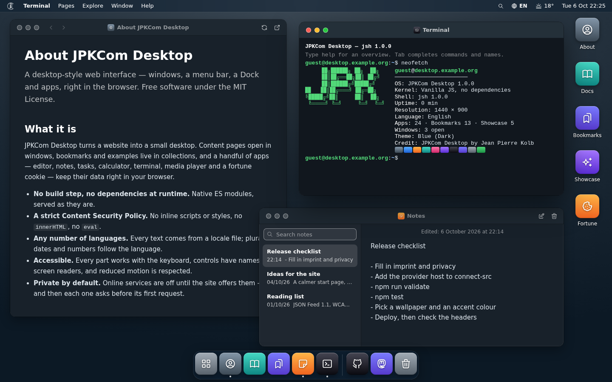
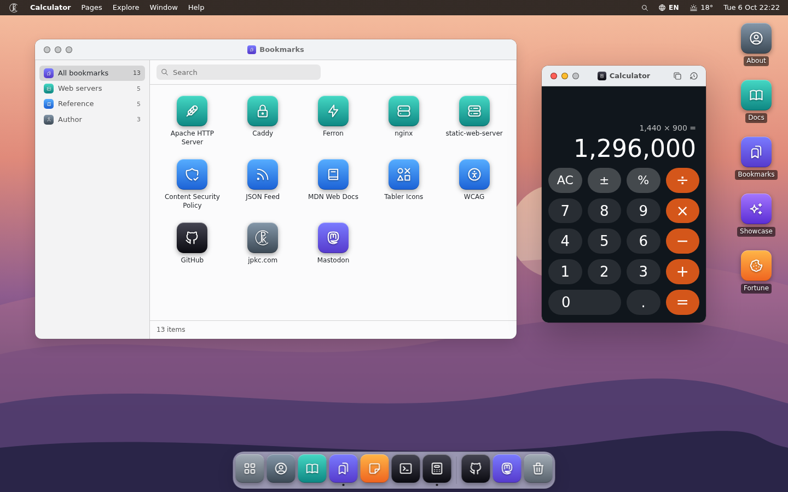
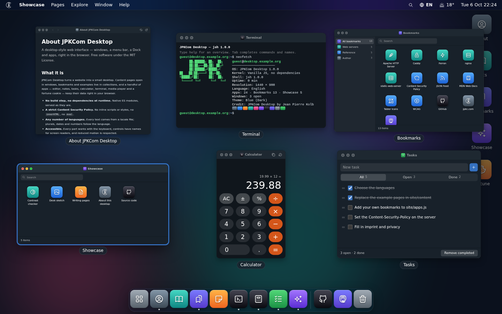
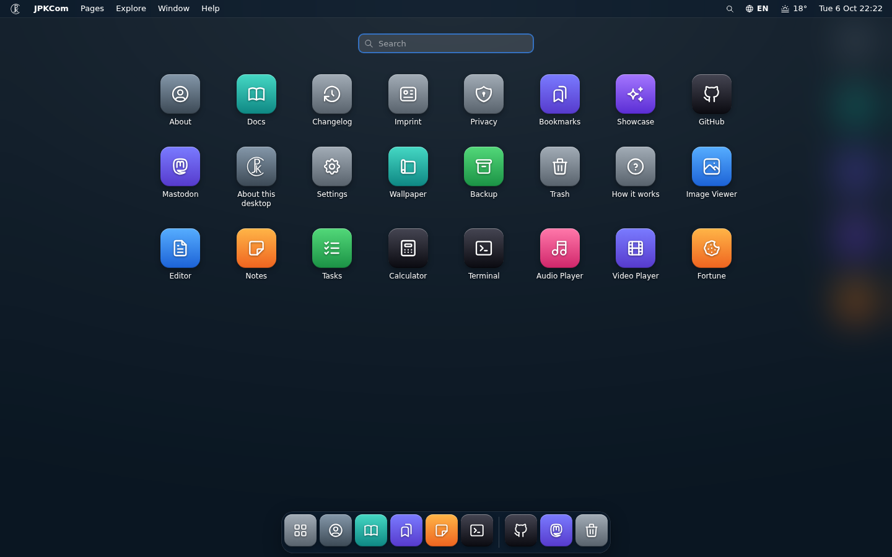
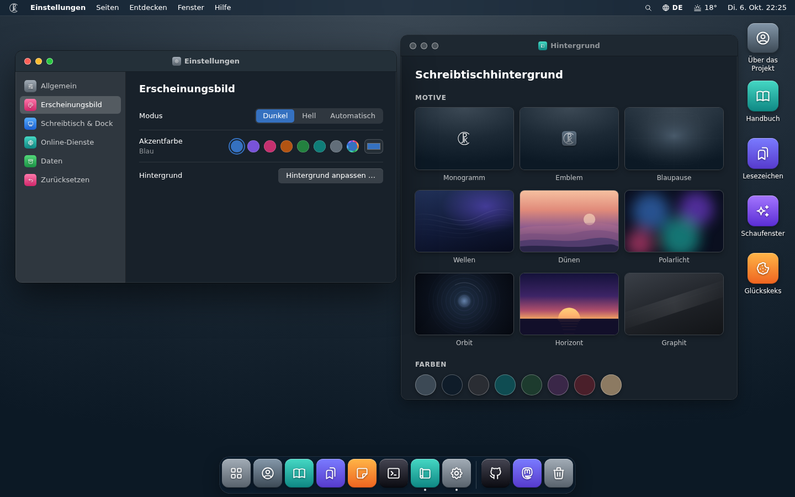
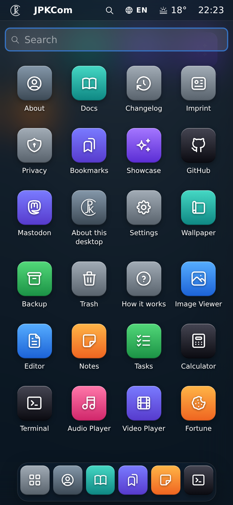

# JPKCom Desktop

**English** | [Deutsch](README.de.md)

**A desktop-style web interface in plain JavaScript: windows, a menu bar, a dock and apps, in the browser.**

**[Live demo](https://jpkcom.github.io/jpkcom-desktop/)** ·
**[Your own site in 10 minutes](docs/quickstart.md)** ·
**Use this template** (the button at the top of the
[repository page](https://github.com/JPKCom/jpkcom-desktop)) to start your own copy.

JPKCom Desktop turns a website into a desktop built on the classic desktop metaphor. Pages open in
windows that can be moved, snapped to an edge and restored on the next visit. A menu bar, a dock, desktop
icons, an "All apps" grid and a quick search lead to the content. The project includes an editor, notes,
tasks, a calculator, a terminal, media players and more. Everything is a set of static files: native ES
modules, no build step, no runtime dependencies and a strict Content Security Policy. You can put it on
any web server, at the root or in a sub-folder.



**JPKCom Desktop by Jean Pierre Kolb** · [JPKCom](https://www.jpkc.com/) · [MIT License](LICENSE)
(except the JPK monogram and the JPKCom logo, see [brand assets](CREDITS.md#brand-assets-not-mit))

## Contents

- [Features](#features)
- [Quick start](#quick-start)
- [Project layout](#project-layout)
- [Configuration and content](#configuration-and-content)
- [Languages](#languages)
- [Look and feel](#look-and-feel)
- [Extending](#extending)
- [Deployment](#deployment)
- [Private bookmarks (vault)](#private-bookmarks-vault)
- [Development](#development)
- [Privacy and security](#privacy-and-security)
- [Credits, license and author](#credits-license-and-author)

---

## Features

**Windows**
- Move, resize, minimise and zoom windows; double-click or double-tap a title bar to zoom.
- Drag a window to the left or right edge to fill that half of the screen, or to the top edge to zoom it.
  A preview shows where it will go. Rest the pointer on the zoom button to open a tile menu (left half,
  right half, full size, both side by side).
- **Overview** (F3 or Ctrl+↑) shows every window scaled side by side. Ctrl+\` switches to the next window.
- **Session restore**: open windows come back on the next visit. Visitors can switch this off.
- Deep links: `#app=<id>`, `#search=<words>` and `#/path` open an app, the search or a page directly.
- Window controls on the left or right, as coloured dots or as plain monochrome glyphs.

**Around the windows**
- **Menu bar** with the brand menu, the menus of your site, the menu of the active app, the search
  button, the language switch, the weather and a clock that opens the calendar.
- **Dock** with pinned apps, running apps and the trash. Visitors can pin and reorder apps, change the
  size and switch on magnification. **Desktop icons**, and **All apps** (a full-screen grid of every app).
- **Search** (Ctrl/⌘+K or `/`) over all apps, collections and any search provider a module adds. An
  optional [Pagefind](https://pagefind.app/) full-text index can be added for the pages of your site.
- Context menus everywhere: right-click, long press on touch screens, Shift+F10 or the ContextMenu key.
- Drop files on the desktop: text opens in the editor, pictures in the image viewer, music and videos in
  the players. Nothing is uploaded.
- A boot screen, plus restart and shut-down screens. Shut down can lead to a URL of your choice.

**Apps** (each one is optional; switch it on or off in `site/config.js`)

| App | What it does |
|---|---|
| Editor | Plain-text editor with tabs, find and replace, word wrap and visible whitespace. Opens and saves local files and keeps a draft in the browser. |
| Notes | Notes with search. Deleted notes go to the trash. |
| Tasks | A to-do list with filters and reordering. Deleted tasks go to the trash. |
| Calculator | Operator precedence, percent, a history and full keyboard control. |
| Terminal | `ls`, `cd`, `open`, `cat`, `man`, `search`, `cal`, `neofetch`, `browser`, `df`, `du`, `lang`, `theme` and more, with tab completion and a history. `dig`/`host` are available as an opt-in. |
| Audio player, Video player | Play files from the visitor's device, with a playlist and tags (MP3 ID3, FLAC). Nothing leaves the device. |
| Image viewer | Pictures of the site and from the device, with an info bar (format, size, dimensions). |
| Fortune | A saying, tip or joke from local files. An online source is available as an opt-in. |
| Catalog | Browses a collection (bookmarks, tools, a portfolio …) by group, with a search field. |
| Reader | Shows the HTML pages of your site natively in a window, sanitised, with no iframe and no scripts. |

Settings, Wallpaper, Backup, Trash, "About this desktop" and "How it works" are part of the core.

**Modules**: a calendar with ISO week numbers; public holidays that are computed, never fetched (the
`de-by` region is included as an example); weather from Open-Meteo or Bright Sky (opt-in); notification
banners from a JSON Feed per language; and the **vault**, encrypted private bookmarks that unlock with
`login` in the terminal.

**Your data, your look**
- **Backup and trash**: visitors can download everything they made as one file and restore it, with a
  preview. Deleted notes and tasks stay in the trash for 30 days.
- **Themes**: dark, light or automatic; accent colours (or any colour, with a contrast check); tile
  tints; wallpapers made of colours, gradients, pictures and generated motifs.
- **Any number of languages**: German and English are included. Another language is a folder of translations.
- **Installable and usable offline** (service worker and web app manifest).
- **Accessible**: the menu bar works with the arrow keys, windows are named dialogs, focus is managed
  and restored, changes are announced through one live region, and reduced motion is respected.
  Everything works with the keyboard.
- **Strict CSP**, no `eval`, no `innerHTML`, no inline styles, no third-party code, **zero runtime
  dependencies**. Nothing contacts another server unless the site switches a service on *and* the
  visitor agrees.

| Light theme | Window overview | All apps |
|---|---|---|
|  |  |  |

| Settings | Phone layout |
|---|---|
|  |  |

## Quick start

**For your own site, start with "Use this template"** on the
[repository page](https://github.com/JPKCom/jpkcom-desktop): GitHub creates a repository of your own
with all files, ready to change and to publish on GitHub Pages. Then clone that repository instead of
this one. [Your own site in 10 minutes](docs/quickstart.md) walks through the five steps from there.

You need Node.js 24 or newer, but only for the tools. The desktop itself is static files.

```sh
git clone https://github.com/JPKCom/jpkcom-desktop.git
cd jpkcom-desktop
sfw npm ci         # development tools only: Tabler icon sources, headless browser checks
npm run serve      # http://127.0.0.1:8080/ with the production security headers
```

Open <http://127.0.0.1:8080/>. There is no build step: edit a file and reload the page.
`npm run serve` itself needs no packages (`node tools/serve.mjs` works without `npm ci`).
`sfw` is [Socket Firewall Free](https://github.com/SocketDev/sfw-free), which blocks malicious packages
during the install; plain `npm ci` works too. Install scripts of packages are switched off (`.npmrc`) —
why, and how to update the tools: [CONTRIBUTING.md → Supply chain](CONTRIBUTING.md#supply-chain).

- `npm run serve -- --base /desktop/` serves the desktop in a sub-folder (<http://127.0.0.1:8080/desktop/>).
- `npm run serve -- --port 3000 --host 0.0.0.0` uses another port and makes the server reachable from your LAN.
- `--connect`, `--frame`, `--wasm` and `--geolocation` open the policy the same way you would on your
  server (see [Deployment](#opening-the-policy-for-online-services)).

**Why not just open `index.html`?** Browsers do not load ES modules from `file://`, and `fetch()`, the
service worker and the stored settings need a real origin. Any static web server works; `npm run serve`
also sends the same security headers as production, so what works locally also works behind the real
policy.

## Project layout

```
index.html, manifest.webmanifest, sw.js   the page, the web app manifest, the service worker
site/          EVERYTHING a site owner changes
  config.js      window.DESKTOP_CONFIG — every option, documented inline, all optional
  apps.js        the site manifest: apps, collections, menus, files for the terminal
  content/       pages for the Reader, one folder per language (+ demos and images)
  data/          fortunes and notification feeds per language
  vault/         sealed private bookmarks (none shipped)
  wallpapers/    picture wallpapers (none shipped)
src/           the desktop itself — core, window manager, shell, panels, modules, apps, CSS, icons
locales/       the texts, one folder per language (en is the reference)
assets/        favicon and app icons
tools/         development tools (serve, icons, checks, sealing) — not uploaded
tests/         unit tests (node --test) — not uploaded
docs/          architecture, package documentation, deployment guide, server configurations
```

The rule: **`site/` is yours, `src/` is the project.** Changing `site/` (and `locales/` for a new
language) adapts the desktop. If you keep `src/` unchanged, you can update by replacing it. `index.html` links `site/theme.css`: when you update an existing site, copy
that file into your `site/` (an empty file is fine) and do not delete it.

## Configuration and content

### `site/config.js`

One classic script that sets `window.DESKTOP_CONFIG`. Every key is optional; what is missing falls back
to the defaults in `src/core/config.js`. An invalid value is reported in the browser console and
replaced by its default, so it never breaks the page. Objects merge key by key with the defaults; arrays
and plain values replace them. Texts that differ per language are maps such as
`{ en: 'Tools', de: 'Werkzeuge' }`. The comments in the file describe every key; the most common ones:

```js
window.DESKTOP_CONFIG = {
	brand: { name: 'My Desktop', shortName: 'My Desktop', menuLabel: 'My Site', themeColor: '#1c2935',
		glyph: 'ti-device-desktop', logo: null, asciiLogo: ['My Site'] }, // replace the JPK defaults (brand assets, see CREDITS.md)
	author: { name: 'Jean Pierre Kolb', brand: 'JPKCom', url: 'https://www.jpkc.com/', links: [/* … */] },
	credit: true,                       // "JPKCom Desktop by Jean Pierre Kolb" in About, boot screen, terminal — please keep it

	languages: ['de', 'en'],            // folders in locales/, in menu order
	defaultLang: 'en',

	theme: { default: 'auto', accent: 'teal', windowControls: { side: 'right', style: 'minimal' } },
	wallpaper: { default: { type: 'gradient', from: '#2b6cb0', to: '#0b1a33', dir: 'diag' } },

	modules: ['reader', 'viewer', 'catalog', 'search', 'calendar', 'holidays', 'weather', 'notify'],
	apps: ['editor', 'notes', 'todo', 'calc', 'terminal', 'media', 'fortune'],

	services: { weather: true },        // online services: off unless listed here, and each visitor still agrees
	weather: { provider: 'open-meteo', defaultPlace: 'berlin' },
	holidays: { region: 'de-by' }
};
```

| Area | Keys |
|---|---|
| Brand and credit | `brand` (name, short name, menu label, glyph, logo, terminal art, theme colour), `author` (name, website, profile links that become apps), `credit` |
| Site | `site.home` (a "Classic website" entry), `site.legal` (imprint/privacy in the brand menu), `site.hosts`, `site.routes`, `site.description`, `about` |
| Languages | `languages`, `defaultLang` |
| Appearance | `theme` (default theme, accent, `accents`, `tints`, `windowControls`), `wallpaper` (`default`, `motifs`, `colors`, `gradients`, `images`) |
| Desktop | `wm` (snapping, sizes, iframe policy), `session`, `dock`, `desktop.icons`, `boot`, `power.shutdownUrl`, `ui` |
| Modules and apps | `modules` (`reader`, `viewer`, `catalog`, `search`, `calendar`, `holidays`, `weather`, `notify`, `vault`, or your own as `{ id, src }`), `apps` (`editor`, `notes`, `todo`, `calc`, `terminal`, `media`, `fortune`). Anything you leave out is not loaded at all. |
| Online services | `services: { weather, geolocation, fortune, dns }` (all `false` by default) |
| Per module | `reader.rules`, `search` (`pagefind`, `shortcut`), `notify.feeds`, `holidays.region`, `calendar`, `weather` (`provider`, `units`, `places`), `fortune`, `media`, `editor`, `calc`, `terminal` (`doh`, `manUrl`), `trash`, `backup`, `vault`, `pwa`, `offline` |

Weather places are `{ id, name, lat, lon, tz }` entries in `weather.places`. Notification feeds are
`notify.feeds: { en: 'site/data/feed.en.json', de: 'site/data/feed.de.json' }`. Several desktops on one
origin need different `namespace` values.

### `site/apps.js`: apps, collections, menus, files

The site manifest is an ES module. The shipped one is an example site to replace with your own:

```js
export default {
	apps: [
		{ id: 'about', kind: 'page', icon: 'ti-user-circle', tint: 'slate', desktop: true, dock: true,
			name: { en: 'About', de: 'Über' },
			url: { en: 'site/content/en/about.html', de: 'site/content/de/about.html' } },
		{ id: 'status', kind: 'web', icon: 'ti-activity', tint: 'green', url: 'status/', name: 'Status' },
		{ id: 'repo', kind: 'link', icon: 'ti-brand-github', tint: 'black', url: 'https://github.com/JPKCom/jpkcom-desktop', name: 'Source' },
		{ id: 'notes', dock: true }               // an override record: changes an app a module brings
	],
	collections: [{
		id: 'bookmarks', prefix: 'link', icon: 'ti-bookmarks', tint: 'indigo', sort: 'alpha',
		name: { en: 'Bookmarks', de: 'Lesezeichen' },
		groups: [{ id: 'reference', name: { en: 'Reference', de: 'Nachschlagen' }, icon: 'ti-book-2' }],
		items: [{ slug: 'mdn', group: 'reference', name: 'MDN Web Docs', url: 'https://developer.mozilla.org/' }]
	}],
	menus: [{ id: 'pages', label: { en: 'Pages', de: 'Seiten' }, items: ['about', '-', { collection: 'bookmarks' }] }],
	files: { about: { en: 'site/content/en/about.md', de: 'site/content/de/about.md' }, license: 'LICENSE' }
};
```

- **App kinds**: `page` (a page of your site in the Reader), `web` (a page in an iframe window), `link`
  (an external page in a new tab, https only), `collection` (a Catalog window), and `alias: '<id>'`
  (shows and launches another app). `desktop`, `dock`, `hidden`, `size` and `tint` place and style an app.
- **Collections**: each item becomes an app `<prefix>-<slug>`. A collection gets a Catalog window, a search
  group and menu entries (`{ collection: id }`) without any code.
- **Menus** take app ids, `'-'` (a separator), `{ collection }`, `{ label, url }` and submenus `{ label, items }`.
- **Files**: what the terminal can `cat`. `.md` files are rendered as Markdown.
- Paths are relative to the desktop's folder, so they work in a sub-folder too.

The full format is in [docs/ARCHITECTURE.md §7](docs/ARCHITECTURE.md#7-site-manifest-siteappsjs). Check
your manifest before you publish:

```sh
npm run validate          # ids, kinds, references, urls (local files exist), icons, a text for every language
```

### Your own app

An app of your own lives in `site/`, next to your content — nothing in `src/` changes, so updates of the
desktop do not touch it. Start from the example app **Hello** in `site/modules/hello/`: a window with its
own texts in every language (`locales/<lang>/hello.js`), its own CSS, a stored value with backup and reset,
and a terminal command. Copy the folder, rename it as the comment at the top of its `index.js` explains,
and list it in `site/config.js`:

```js
apps: [ …, { id: 'my-app', src: 'site/modules/my-app/index.js' } ],
```

`npm run i18n:check` checks its texts like the desktop's own. The full descriptor reference is in
[docs/ARCHITECTURE.md §8](docs/ARCHITECTURE.md#8-module-descriptor) and
[§21](docs/ARCHITECTURE.md#21-how-to-add-).

### Pages for the Reader

Plain HTML files in `site/content/<lang>/`. The default rule (`config.reader.rules`) takes the first
`main article`, `article` or `main` as the content, its `h1` as the title and a `.lead` paragraph as the
lead:

```html
<!doctype html>
<html lang="en">
<head>
<meta charset="utf-8">
<title>Page title | My Site</title>                      <!-- window title: the part before " | " -->
<link rel="alternate" hreflang="de" href="../de/page.html"> <!-- the page after a language switch -->
<link rel="stylesheet" href="../content.css">            <!-- only used outside the desktop -->
</head>
<body><main><article>
<h1>Page title</h1>
<p class="lead">One or two sentences about the page.</p>
<p>Text, <a href="other.html">links</a>, lists, tables, figures …</p>
</article></main></body>
</html>
```

The Reader parses pages without running them and keeps only allowed elements. Scripts, styles,
`style` attributes, forms, iframes and event handlers are removed. Write pages without them, because
the CSP would also report them while a page is parsed. Classes get a `c-` prefix, so a page cannot pick
up the desktop's styles. Relative links open in the same window and links to other sites open in a new
tab. The example page "Writing pages" (`site/content/en/docs/pages.html`)
has the details.

### Fortunes and feeds

- **Fortunes**: `site/data/fortunes/<lang>.json`, with plain text only (at most 1000 characters per
  saying). List the languages that have a file in `fortune.langs`.

  ```json
  { "lang": "en", "by": "My Site",
    "categories": { "tips": "Tips" },
    "items": ["A plain saying.", { "text": "Press F3 to see all windows.", "cat": "tips" }] }
  ```

- **Notifications**: a [JSON Feed 1.1](https://www.jsonfeed.org/version/1.1/) per language, on the same
  origin (`notify.feeds`). New items show up as banners and in the calendar. Items need a `title`, a past
  `date_published` and a same-origin `url`.

## Languages

German (`de`) and English (`en`) are included. No code assumes a fixed number of languages. With two
languages the menu bar shows a toggle; with three or more it shows a menu. To add one, for example French:

1. Copy the reference folder: `cp -r locales/en locales/fr`.
2. Edit `locales/fr/_meta.js`:
   ```js
   export default { name: 'Français', intl: 'fr-FR', dir: 'ltr', yes: '^(o|oui|y|yes)$' };
   ```
   `name` is the language's own name, `intl` the BCP 47 tag for dates, numbers and plurals, `dir` is
   `'ltr'` or `'rtl'`, and `yes` matches "yes" answers in the terminal.
3. Translate the values in every file. Keep the keys and the `{placeholders}`. Plurals are objects with
   the categories your language needs (`one`, `few`, `many`, `other`, …).
4. Add the code to `site/config.js`: `languages: ['de', 'en', 'fr']`.
5. Check it:
   ```sh
   npm run i18n:check -- fr   # missing keys, placeholder mismatches, plural categories
   npm run validate           # every text map in site/ has a value for every language
   ```
6. Optional: pages in `site/content/fr/`, `site/data/fortunes/fr.json` (and `'fr'` in `fortune.langs`),
   `site/data/feed.fr.json` (and `notify.feeds.fr`), and a `<p lang="fr">` line in the `<noscript>`
   block of `index.html`.

A missing key never breaks anything. It falls back to the base language (`pt-BR` → `pt`), then
`defaultLang`, then English. With `debug: true` the console lists every key that fell back. The details,
including the keys that are formats rather than sentences, are in [locales/README.md](locales/README.md).

## Look and feel

Everything below is set in `site/config.js`. Visitors can then choose for themselves in Settings and
Wallpaper.

```js
theme: {
	default: 'dark',                                  // 'dark' | 'light' | 'auto' (follows the system)
	accent: 'blue',
	allowCustomAccent: true,                          // a colour picker; text on it turns black or white
	accents: { brand: '#0f6b8f', pink: null },        // add your own (white text needs ≥ 4.5:1), null removes one
	tints: { brand: ['#3fb6e0', '#0f6b8f'] },         // tile gradients [top, bottom]; apps use tint: 'brand'
	windowControls: { side: 'left', style: 'classic' } // 'left' | 'right', 'classic' (dots) | 'minimal' (glyphs)
},
wallpaper: {
	default: { type: 'svg', id: 'waves' },            // or { type: 'gradient' | 'color' | 'image', … }
	motifs: ['waves', 'dunes', 'aurora', 'orbit', 'horizon', 'graphite'],
	colors: [{ id: 'petrol', color: '#0f4c52', name: { en: 'Petrol', de: 'Petrol' } }],
	gradients: [{ id: 'ocean', from: '#2b6cb0', to: '#0b1a33', dir: 'diag', name: { en: 'Ocean', de: 'Ozean' } }],
	images: [{ id: 'harbour', src: 'site/wallpapers/harbour.webp', name: { en: 'Harbour', de: 'Hafen' },
		credit: 'Photo: Jane Doe, CC BY 4.0', tone: 'dark' }]
}
```

- **Gradients** take a direction: `glow` (light from the top), `down`, `diag` or `radial`.
- **Generated motifs** are SVG pictures drawn in the browser. `author-monogram` and `author-emblem` show
  the JPK monogram and the JPKCom logo (brand assets, not MIT — see [CREDITS.md](CREDITS.md#brand-assets-not-mit)),
  `author-blueprint` their construction lines; `waves`, `dunes`, `aurora`, `orbit`, `horizon` and
  `graphite` are neutral.
- **Pictures** go into `site/wallpapers/` (WebP or AVIF, about 2560 × 1600). Set `tone: 'light'` for a
  bright picture so the menu bar and icon labels stay readable. See
  [site/wallpapers/README.md](site/wallpapers/README.md).
- **Accent names**: name a new accent in the `settings` namespace of each language as `accent.<id>`.
  Otherwise its id is shown.

**CSS tokens.** Every colour, radius, font and size is a custom property in `src/css/tokens.css` (the
groups are listed in [ARCHITECTURE §17](docs/ARCHITECTURE.md#17-css-conventions-and-tokens)).

**Your own theme.** Put token overrides into `site/theme.css` inside `@layer themes`. It is loaded before the
first paint and kept offline, and the `themes` layer wins over every other layer. Families such as
`--radius-control` or `--glass-backdrop` change every part at once. All tokens and the rules (light and
dark, dark islands, phones) are in [docs/theming.md](docs/theming.md).

```css
/* site/theme.css */
@layer themes {
	:root { --radius-control: 2px; --radius-panel: 4px; --radius-win: 4px; }
	body.compact { --radius-win: 4px; }
}
```

**Rebranding**: `brand` in `site/config.js` (with `glyph`, `logo` and `asciiLogo`); `name`, `short_name`
and `theme_color` in `manifest.webmanifest`; the static lines of `index.html` (title, description,
`<noscript>`); your own `assets/icons/favicon.svg` and `maskable.svg`, then `npm run icons:pwa`;
`wallpaper.motifs` without `author-monogram` and `author-emblem`. The JPK monogram and the JPKCom logo
are not MIT: you may show them unchanged as the default brand, but not use them as your own logo
([brand assets](CREDITS.md#brand-assets-not-mit)). Please keep `credit: true` and
the `author`/`generator` meta tags. [docs/deploy.md §11](docs/deploy.md#11-offline-use-and-installation-pwa)
lists every line.

## Extending

Everything optional is a module: a descriptor object that declares apps, stored data, translations,
styles and **contributions** to extension points. Modules never import each other; they use the public
API (`window.JPKDesk`, or `import Desk from 'src/core/api.js'`), services and events. A site module lives
in `site/` and is listed as `{ id, src }`:

```js
/* site/modules/hello/index.js
   site/config.js: modules: [ …, { id: 'hello', src: 'site/modules/hello/index.js' } ] */
import Desk from '../../../src/core/api.js';

const { h, L } = Desk;

export default {
	id: 'hello',
	kind: 'module',

	/* The app this module brings (its id is the module id) */
	app: {
		name: { en: 'Hello', de: 'Hallo' },
		desc: { en: 'A tiny example app', de: 'Eine winzige Beispiel-App' },
		icon: 'ti-mood-smile',
		tint: 'green',
		size: [420, 240]
	},

	/* Window hook: build the content into the window body (no innerHTML: h() and text) */
	mount(win, body) {
		body.append(h('p', { class: 'hello-text', text: L({ en: 'Hello from a site module.', de: 'Hallo aus einem Site-Modul.' }) }));
	},

	/* A contribution to the terminal: the command `hello` */
	terminal: {
		hello: {
			help: { en: 'say hello', de: 'Hallo sagen' },
			run(args, io) {
				io.say(L({ en: 'Hello, world!', de: 'Hallo, Welt!' }));
			}
		}
	}
};
```

Use a new icon? Run `npm run icons` (see below).

| Extension point | Descriptor field | Example |
|---|---|---|
| Apps and window hooks | `app` / `apps`, `mount`, `serialize`, `restore`, `menu`, `beforeClose`, … | above |
| Terminal commands | `terminal: { name: { run(args, io, ctx), help, usage, man, complete } }` | above; at runtime `Desk.terminal.register()` |
| Search providers | `search: [{ id, label, order, async search(q, ctx) → [{ title, sub, app, url, run }] }]` | at runtime `Desk.search.addProvider()` |
| Settings | `settingsSections: [{ id, label, icon, order }]`, `settings: [{ id, section, order, render(ctx) }]` | a row with a built-in id replaces it |
| Keyboard shortcuts | `shortcuts: [{ id, keys: 'Alt+N', scope, run(e) }]` | |
| Context menus | `contextMenu: [{ selector, items(el, ctx) }]` | |
| File drops | `files: { kind: { accept: ['.ext'], label, open(file, ctx) } }` | |
| Calendar sections | `calendar: [{ id, order, render(ctx) }]` | |
| Stored data | `storage`, `resetGroups`, `trash` (backup, reset and trash work automatically) | |
| Online services | `consent: [{ id, hosts, label, hint }]` + `Desk.net.getJson(url, { service: id })` | |
| Wallpaper motifs, weather providers, holiday regions | `Desk.wallpaper.register()`, `Desk.weather.addProvider()`, `Desk.holidays.addRegion()` | |

**Icons** come from [Tabler Icons](https://tabler.io/icons): outline `ti-<name>`, filled `tif-<name>`.
Only the icons that are actually used ship. `npm run icons` scans `src/`, `site/` and `index.html`, then
writes `src/icons/tabler.js`. Icons that no source file names (for example ones used only in sealed vault
data) go into `site/icons.json` as a JSON array (`["ti-briefcase"]`). `npm run icons:check` verifies the
file is up to date.

The complete contract is in [docs/ARCHITECTURE.md](docs/ARCHITECTURE.md): module descriptor (§8),
public API (§9), services (§10), events (§11), i18n (§12), storage (§14), CSS (§17), "How to add …"
(§21). Each package is documented in [docs/packages/](docs/packages/).

## Deployment

### Requirements

- **Any static web server** that can send a few headers. There is no server-side code and no build step.
- **HTTPS.** The service worker (offline use, installation), the vault (Web Crypto) and "My location"
  for the weather only work in a secure context. Over plain HTTP the desktop still runs, without those
  features. (`http://localhost` counts as secure during development.)
- **The web root or any sub-folder.** Every path is relative to the folder that holds `index.html`.
  `https://example.org/desktop` must redirect to `https://example.org/desktop/`, and every configuration
  below does this.
- **Caching:** `Cache-Control: no-cache` for HTML, JS, CSS, JSON, the manifest and `sw.js`, because the
  file names carry no version. Browsers revalidate their copies (`304`), so an update shows on the next
  reload. Images, fonts and media get one day.
- **No directory listings** anywhere, and **no dotfiles** (`.git`, `.env`).
- **The security headers** below, on every response including errors.

**What to upload**: `index.html`, `manifest.webmanifest`, `sw.js`, `assets/`, `locales/`, `site/`,
`src/`, `LICENSE` and `CREDITS.md`. Do **not** upload `node_modules/`, `tools/`, `tests/`, `docs/`,
`.git/`, `package.json` or `package-lock.json`. The configurations only refuse dotfiles; they do not hide
those folders for you.

**Same origin = full trust.** Every page on the desktop's origin can read its stored data. Serve only
your own code there. Third-party demos belong on another origin, or in a `web` app with
`sandbox: 'allow-scripts'` (never together with `allow-same-origin`).
[docs/deploy.md §3](docs/deploy.md#3-at-the-web-root-or-in-a-sub-folder) explains why.

**GitHub Pages.** The workflow `.github/workflows/pages.yml` publishes the site as it is, without a
build step: the [live demo](https://jpkcom.github.io/jpkcom-desktop/), and your copy of the template at
`https://<user>.github.io/<repo>/` once you choose "GitHub Actions" as the Pages source and set the
repository variable `PAGES` to `true`. Unlike the upload list above, it also publishes `docs/` and the
package and top-level files, which is harmless. Pages cannot send headers, so the workflow adds the policy as a
`<meta>` tag. That tag cannot carry `frame-ancestors`, and `Permissions-Policy` and the other headers are
missing. For the full set, use your own server.
[docs/deploy.md](docs/deploy.md#github-pages) has the details.

### The Content Security Policy

Every configuration sends this policy. On HTTPS it adds `upgrade-insecure-requests` and HSTS. Apache
adds both only when the request came over HTTPS; `npm run serve` sends neither because it speaks plain
HTTP.

```
default-src 'self'; script-src 'self'; style-src 'self'; img-src 'self' data: blob:; media-src 'self' blob:;
font-src 'self'; connect-src 'self' blob:; frame-src 'self'; worker-src 'self'; manifest-src 'self';
object-src 'none'; base-uri 'self'; form-action 'self'; frame-ancestors 'self'
```

It also sends `Permissions-Policy` (everything off, geolocation only when you offer "My location"),
`X-Frame-Options: SAMEORIGIN` (windows frame same-origin pages, so `DENY` would break them),
`X-Content-Type-Options: nosniff`, `Referrer-Policy: strict-origin-when-cross-origin`,
`Cross-Origin-Opener-Policy: same-origin` and `Strict-Transport-Security: max-age=31536000; includeSubDomains`.
Keep `blob:` in `img-src`, `media-src` and `connect-src`: pictures, music and videos from the visitor's
device play from `blob:` URLs and never leave the device.

### Opening the policy for online services

Every online service is **off** by default (`services` in `site/config.js`), and each visitor is asked
before the first request. When you switch one on, also allow its host in your server's policy. Otherwise
the browser blocks the request.

| Feature | `site/config.js` | Add to the policy |
|---|---|---|
| Weather, worldwide | `'weather'` in `modules`, `services.weather: true`, `weather.provider: 'open-meteo'` | `connect-src https://api.open-meteo.com` |
| Weather, Germany | as above, `weather.provider: 'brightsky'` | `connect-src https://api.brightsky.dev` |
| "My location" for the weather | `services.geolocation: true` | `Permissions-Policy: … geolocation=(self) …` |
| `dig`, `host`, `nslookup` in the terminal (DNS-over-HTTPS) | `services.dns: true`, `terminal.doh: { url: 'https://dns.google/resolve', name: 'dns.google' }` | `connect-src https://dns.google` (the host of `terminal.doh.url`) |
| Fortune, online jokes | `services.fortune: true`, `fortune.remote: 'jokeapi'` | `connect-src https://v2.jokeapi.dev` |
| Fortune, online facts | `services.fortune: true`, `fortune.remote: 'uselessfacts'` | `connect-src https://uselessfacts.jsph.pl` |
| Full-text search (Pagefind) | `search.pagefind: { path: 'pagefind/pagefind.js' }` | `script-src 'wasm-unsafe-eval'` (WebAssembly; nothing else needs it) |
| `web` apps from another origin (external iframes) | an app with `kind: 'web'` and a foreign `url` | `frame-src https://apps.example.org` |

**How to edit the configuration.** Next to its active `Content-Security-Policy` line, each file below
has a comment that lists these hosts and two commented example lines (weather + DNS-over-HTTPS;
Pagefind + an app from another origin). Copy the active line, add only what you switch on, and put the
copy in place of the active line. Keep `upgrade-insecure-requests` where the active line has it. For
"My location", swap the active `Permissions-Policy` line for the commented one below it, which contains
`geolocation=(self)`. Example with weather and the DNS commands:

```
connect-src 'self' blob: https://api.open-meteo.com https://dns.google;
```

Try the same additions locally first:

```sh
npm run serve -- --connect https://api.open-meteo.com,https://dns.google --frame https://apps.example.org --wasm --geolocation
```

### Server setup

Each configuration is complete on its own and works at the web root and in a sub-folder without
changes. Each one was tested by running the server, requesting the desktop at `/` and at `/desktop/`,
and checking the redirect, headers, policy, MIME types, caching, `304`, listings and dotfiles. In every
file, replace `example.org` with your host name and `/var/www/example.org` with the folder your files
are in (the desktop can be in a sub-folder of it). Where present, also replace the certificate paths
`/etc/ssl/example.org/…`. The files are also in [docs/server/](docs/server/), and
[docs/deploy.md](docs/deploy.md) explains the background.

#### Apache 2.4

1. **Where:** copy [`docs/server/apache.htaccess`](docs/server/apache.htaccess) as **`.htaccess`** into
   the folder that holds `index.html`. There is nothing to replace inside.
2. **Modules:** Apache 2.4.10+ with `mod_headers`, `mod_mime` and `mod_alias`. `mod_dir`, `mod_deflate`
   and `mod_brotli` are used when present. On Debian/Ubuntu run `a2enmod headers mime alias`.
3. **AllowOverride:** the vhost must allow the directives for that folder, otherwise Apache answers `500`:
   ```apache
   <Directory "/var/www/example.org">
       AllowOverride FileInfo Indexes Options=Indexes
   </Directory>
   ```
   (`AllowOverride All` works too.)
4. **HTTPS** comes from your vhost (certificate there). `upgrade-insecure-requests` and HSTS are added
   only when `%{HTTPS}` is on. **Behind a proxy that terminates TLS**, change both conditions from
   `"expr=%{HTTPS} == 'on'"` to `"expr=%{HTTP:X-Forwarded-Proto} == 'https'"`.
5. **Online services:** edit the `Header always set Content-Security-Policy` line, and the
   `Header always set Permissions-Policy` line for "My location". The Apache lines carry no
   `upgrade-insecure-requests`; it is appended on HTTPS.
6. **Check and reload:** `apachectl configtest && apachectl graceful` (Debian: `apache2ctl`).
   `configtest` does not read `.htaccess`; an error in it shows up as `500` on a request (see the error log).

<details>
<summary><code>.htaccess</code> (complete)</summary>

<!-- server-config: docs/server/apache.htaccess -->
```apache
# ============================================================================
# JPKCom Desktop — Apache configuration (.htaccess) — © Jean Pierre Kolb — MIT License
# ============================================================================
#
# Copy this file as ".htaccess" into the folder that holds index.html — the web
# root or a sub-folder such as /desktop/; nothing in it depends on the folder.
# Apache 2.4.10 or newer with mod_headers, mod_mime and mod_alias (mod_dir,
# mod_deflate, mod_brotli are used when present). The host must allow it:
#   AllowOverride FileInfo Indexes Options=Indexes
# (or "AllowOverride All"). Nothing here inherits from a parent .htaccess on
# purpose: the header set is complete on its own and replaces security headers
# a parent .htaccess or the server config may send.
#
# Service worker, installation, the vault and "My location" need a secure
# context: serve the desktop over HTTPS (localhost is the only exception).
#
# Check after a deploy:
#   curl -sI https://example.org/desktop/ | grep -iE '^(content-security|permissions|cache-control|x-)'

# ---------- Files and folders ------------------------------------------------

# No directory listings anywhere (the vault's file names must stay secret)
Options -Indexes

# /desktop → /desktop/ (manifest, service worker and data are resolved relative to the page)
<IfModule mod_dir.c>
	DirectorySlash On
	DirectoryIndex index.html
</IfModule>

# Dotfiles (.git, .env, this file, …) are never served — /.well-known/ stays reachable.
# mod_alias is part of every standard Apache; deliberately without <IfModule>: should it
# be missing, Apache answers 500 instead of handing out .git/ or .env
RedirectMatch 404 "/\.(?!well-known/)"

# ---------- MIME types ---------------------------------------------------------

<IfModule mod_mime.c>
	AddType text/javascript .js .mjs
	AddType application/manifest+json .webmanifest
	AddType application/json .json
	AddType image/svg+xml .svg
	AddType application/octet-stream .bin
	AddCharset utf-8 .html .js .mjs .css .json .webmanifest .svg .md .txt
</IfModule>

# ---------- Compression ------------------------------------------------------

<IfModule mod_brotli.c>
	AddOutputFilterByType BROTLI_COMPRESS text/html text/css text/javascript application/json application/manifest+json image/svg+xml
</IfModule>
<IfModule mod_deflate.c>
	AddOutputFilterByType DEFLATE text/html text/css text/javascript application/json application/manifest+json image/svg+xml
</IfModule>

<IfModule mod_headers.c>
# Inside <Files>: Apache applies <Files>/<FilesMatch> sections after all directory and .htaccess
# directives, parents first — so only here do these headers win over a parent's <FilesMatch>.
<Files "*">

	# ---------- Security headers -----------------------------------------------

	# A parent .htaccess or the server config may set these with plain "Header set" (another
	# table than "always"): remove those copies, or browsers would get two policies and apply both
	Header unset Content-Security-Policy
	Header unset Permissions-Policy
	Header unset X-Frame-Options
	Header unset X-Content-Type-Options
	Header unset Referrer-Policy
	Header unset Cross-Origin-Opener-Policy
	Header unset Strict-Transport-Security

	# Content-Security-Policy. Opt-in extensions — switch on ONLY what the site offers:
	#
	#   connect-src  add the hosts of the online services set to true in site/config.js → services:
	#                  weather, provider 'open-meteo':  https://api.open-meteo.com
	#                    a place search by name, if you add one: https://geocoding-api.open-meteo.com (the shipped providers never call it)
	#                  weather, provider 'brightsky':   https://api.brightsky.dev
	#                  terminal dig/host (DoH):         https://dns.google   (the host of terminal.doh.url)
	#                  fortune, remote 'jokeapi':       https://v2.jokeapi.dev
	#                  fortune, remote 'uselessfacts':  https://uselessfacts.jsph.pl
	#   frame-src    add the origins of 'web' apps whose url lives on another origin
	#   script-src   add 'wasm-unsafe-eval' only for the optional Pagefind search (WebAssembly)
	#
	# Then replace the line below with your extended copy, e.g. weather + DoH:
	#   Header always set Content-Security-Policy "default-src 'self'; script-src 'self'; style-src 'self'; img-src 'self' data: blob:; media-src 'self' blob:; font-src 'self'; connect-src 'self' blob: https://api.open-meteo.com https://dns.google; frame-src 'self'; worker-src 'self'; manifest-src 'self'; object-src 'none'; base-uri 'self'; form-action 'self'; frame-ancestors 'self'"
	# or with Pagefind and a framed app from another origin:
	#   Header always set Content-Security-Policy "default-src 'self'; script-src 'self' 'wasm-unsafe-eval'; style-src 'self'; img-src 'self' data: blob:; media-src 'self' blob:; font-src 'self'; connect-src 'self' blob:; frame-src 'self' https://apps.example.org; worker-src 'self'; manifest-src 'self'; object-src 'none'; base-uri 'self'; form-action 'self'; frame-ancestors 'self'"
	Header always set Content-Security-Policy "default-src 'self'; script-src 'self'; style-src 'self'; img-src 'self' data: blob:; media-src 'self' blob:; font-src 'self'; connect-src 'self' blob:; frame-src 'self'; worker-src 'self'; manifest-src 'self'; object-src 'none'; base-uri 'self'; form-action 'self'; frame-ancestors 'self'"
	# On HTTPS: upgrade-insecure-requests and HSTS. Behind a proxy that terminates TLS, use
	# "expr=%{HTTP:X-Forwarded-Proto} == 'https'" instead of "expr=%{HTTPS} == 'on'".
	Header always edit Content-Security-Policy "$" "; upgrade-insecure-requests" "expr=%{HTTPS} == 'on'"
	Header always set Strict-Transport-Security "max-age=31536000; includeSubDomains" "expr=%{HTTPS} == 'on'"

	# Geolocation stays off unless the site offers "My location" for the weather
	# (services.geolocation: true) — then use the second line instead
	Header always set Permissions-Policy "accelerometer=(), camera=(), geolocation=(), gyroscope=(), magnetometer=(), microphone=(), payment=(), usb=()"
	# Header always set Permissions-Policy "accelerometer=(), camera=(), geolocation=(self), gyroscope=(), magnetometer=(), microphone=(), payment=(), usb=()"

	# SAMEORIGIN, not DENY: windows show same-origin pages in iframes
	Header always set X-Frame-Options "SAMEORIGIN"
	Header always set X-Content-Type-Options "nosniff"
	Header always set Referrer-Policy "strict-origin-when-cross-origin"
	Header always set Cross-Origin-Opener-Policy "same-origin"

	# ---------- Caching --------------------------------------------------------

	# The files carry no version in their names: browsers revalidate them on every use (ETag /
	# Last-Modified → 304), the service worker does the same. Images, fonts and media: one day.
	Header set Cache-Control "no-cache"
	Header set Cache-Control "public, max-age=86400" "expr=%{REQUEST_URI} =~ m#\.(png|jpe?g|gif|webp|avif|ico|woff2?|mp3|ogg|oga|m4a|wav|mp4|webm)$#i"
	Header unset Expires

	# ---------- Sealed vault files (site/vault/) -------------------------------

	# The file name is derived from the credentials: never listed (see Options above),
	# always revalidated (a re-sealed file must not come from a cache), not for search engines
	Header always set X-Robots-Tag "noindex, nofollow, noarchive" "expr=%{REQUEST_URI} =~ m#/site/vault/#"

</Files>
</IfModule>
```
<!-- /server-config -->

</details>

#### nginx

1. **Where:** copy [`docs/server/nginx.conf`](docs/server/nginx.conf) to `/etc/nginx/conf.d/desktop.conf`
   (or to `sites-available/` with a link in `sites-enabled/`). It is read inside `http { }` and holds two
   `map` blocks, an HTTP → HTTPS redirect and the HTTPS server.
2. **Replace:** `server_name` (twice), `root`, `ssl_certificate` and `ssl_certificate_key`. Requires nginx
   1.19+; `http2 on;` needs 1.25.1+ (on older versions write `listen 443 ssl http2;` instead).
3. **Never put `add_header` into a `location` block** you add: in nginx it removes every server-level
   header for that location. The path-dependent values come from the two maps for that reason.
4. **Online services:** edit the `add_header Content-Security-Policy … always;` line and, for "My
   location", the `add_header Permissions-Policy` line.
5. **Check and reload:** `nginx -t && nginx -s reload` (or `systemctl reload nginx`).

<details>
<summary><code>nginx.conf</code> (complete)</summary>

<!-- server-config: docs/server/nginx.conf -->
```nginx
# ============================================================================
# JPKCom Desktop — nginx configuration — © Jean Pierre Kolb — MIT License
# ============================================================================
#
# A complete site file for /etc/nginx/conf.d/ (or sites-available/): it is read
# inside the http { } block, which is why the map blocks may stand at the top.
# Replace example.org, the certificate paths and the root folder. nginx 1.19+.
#
# Root or sub-folder: copy the desktop's files into the root folder itself
# (https://example.org/) or into a folder below it (https://example.org/desktop/).
# Nothing else changes — the rules below match the desktop's paths wherever they
# are. A request for /desktop (without the slash) is answered with a redirect to
# /desktop/ by nginx itself (a directory; no try_files with $uri/ here, which would
# serve the page without the slash and break its relative paths).
#
# Why the maps: an add_header inside a location removes every add_header of the
# server block for that location. All headers are therefore set once, at server
# level, with values that depend on the path (an empty value sends no header).
#
# Service worker, installation, the vault and "My location" need a secure
# context: serve the desktop over HTTPS (localhost is the only exception).
#
# Check after a deploy:
#   curl -sI https://example.org/desktop/ | grep -iE '^(content-security|permissions|cache-control|x-)'

# ---------- Path-dependent header values ------------------------------------

# Images, fonts and media: one day. Everything else (HTML, JS, CSS, JSON, manifest, sw.js,
# sealed vault files): revalidated on every use (ETag / Last-Modified → 304).
map $uri $desk_cache_control {
	default "no-cache";
	~*\.(?:png|jpe?g|gif|webp|avif|ico|woff2?|mp3|ogg|oga|m4a|wav|mp4|webm)$ "public, max-age=86400";
}

# Sealed vault files: not for search engines
map $uri $desk_robots {
	default "";
	~/site/vault/ "noindex, nofollow, noarchive";
}

# ---------- HTTP → HTTPS -----------------------------------------------------

server {
	listen 80;
	listen [::]:80;
	server_name example.org;
	server_tokens off;   # no version number in the Server header, here as in the HTTPS server
	return 301 https://$host$request_uri;
}

# ---------- The site -----------------------------------------------------------

server {
	listen 443 ssl;
	listen [::]:443 ssl;
	http2 on;
	server_name example.org;

	ssl_certificate     /etc/ssl/example.org/fullchain.pem;
	ssl_certificate_key /etc/ssl/example.org/privkey.pem;

	root /var/www/example.org;
	index index.html;

	# No directory listings (the vault's file names must stay secret); relative redirects
	autoindex off;
	absolute_redirect off;
	server_tokens off;
	charset utf-8;
	charset_types text/css text/javascript application/json application/manifest+json image/svg+xml text/plain text/markdown;

	gzip on;
	gzip_vary on;
	gzip_types text/css text/javascript application/json application/manifest+json image/svg+xml text/plain text/markdown;

	# ---------- Security headers ---------------------------------------------

	# Content-Security-Policy. Opt-in extensions — switch on ONLY what the site offers:
	#
	#   connect-src  add the hosts of the online services set to true in site/config.js → services:
	#                  weather, provider 'open-meteo':  https://api.open-meteo.com
	#                    a place search by name, if you add one: https://geocoding-api.open-meteo.com (the shipped providers never call it)
	#                  weather, provider 'brightsky':   https://api.brightsky.dev
	#                  terminal dig/host (DoH):         https://dns.google   (the host of terminal.doh.url)
	#                  fortune, remote 'jokeapi':       https://v2.jokeapi.dev
	#                  fortune, remote 'uselessfacts':  https://uselessfacts.jsph.pl
	#   frame-src    add the origins of 'web' apps whose url lives on another origin
	#   script-src   add 'wasm-unsafe-eval' only for the optional Pagefind search (WebAssembly)
	#
	# Then replace the line below with your extended copy, e.g. weather + DoH:
	#   add_header Content-Security-Policy "default-src 'self'; script-src 'self'; style-src 'self'; img-src 'self' data: blob:; media-src 'self' blob:; font-src 'self'; connect-src 'self' blob: https://api.open-meteo.com https://dns.google; frame-src 'self'; worker-src 'self'; manifest-src 'self'; object-src 'none'; base-uri 'self'; form-action 'self'; frame-ancestors 'self'; upgrade-insecure-requests" always;
	# or with Pagefind and a framed app from another origin:
	#   add_header Content-Security-Policy "default-src 'self'; script-src 'self' 'wasm-unsafe-eval'; style-src 'self'; img-src 'self' data: blob:; media-src 'self' blob:; font-src 'self'; connect-src 'self' blob:; frame-src 'self' https://apps.example.org; worker-src 'self'; manifest-src 'self'; object-src 'none'; base-uri 'self'; form-action 'self'; frame-ancestors 'self'; upgrade-insecure-requests" always;
	add_header Content-Security-Policy "default-src 'self'; script-src 'self'; style-src 'self'; img-src 'self' data: blob:; media-src 'self' blob:; font-src 'self'; connect-src 'self' blob:; frame-src 'self'; worker-src 'self'; manifest-src 'self'; object-src 'none'; base-uri 'self'; form-action 'self'; frame-ancestors 'self'; upgrade-insecure-requests" always;

	# Geolocation stays off unless the site offers "My location" for the weather
	# (services.geolocation: true) — then use the second line instead
	add_header Permissions-Policy "accelerometer=(), camera=(), geolocation=(), gyroscope=(), magnetometer=(), microphone=(), payment=(), usb=()" always;
	# add_header Permissions-Policy "accelerometer=(), camera=(), geolocation=(self), gyroscope=(), magnetometer=(), microphone=(), payment=(), usb=()" always;

	# SAMEORIGIN, not DENY: windows show same-origin pages in iframes
	add_header X-Frame-Options "SAMEORIGIN" always;
	add_header X-Content-Type-Options "nosniff" always;
	add_header Referrer-Policy "strict-origin-when-cross-origin" always;
	add_header Cross-Origin-Opener-Policy "same-origin" always;
	add_header Strict-Transport-Security "max-age=31536000; includeSubDomains" always;

	# Caching and the vault (values from the maps above)
	add_header Cache-Control $desk_cache_control;
	add_header X-Robots-Tag $desk_robots always;

	# ---------- Locations (no add_header in here — see above) -------------------

	# Dotfiles (.git, .env, …) are never served
	location ~ /\.(?!well-known/) {
		return 404;
	}

	# MIME types that the stock mime.types lacks or names differently (.js is still
	# application/javascript there; RFC 9239 says text/javascript). A types { } block here
	# would replace the whole list of the http block, so each one gets its own small location.
	location ~* \.webmanifest$ {
		types { }
		default_type application/manifest+json;
	}
	location ~* \.m?js$ {
		types { }
		default_type text/javascript;
	}
	location ~* \.bin$ {
		types { }
		default_type application/octet-stream;
	}

	location / {
	}
}
```
<!-- /server-config -->

</details>

#### Caddy 2

1. **Where:** copy [`docs/server/Caddyfile`](docs/server/Caddyfile) to `/etc/caddy/Caddyfile`, or
   `import` it from yours. Requires Caddy 2.7+.
2. **Replace:** the site address `example.org` and `root * /var/www/example.org`. HTTPS is automatic:
   Caddy fetches the certificate and redirects HTTP to HTTPS.
3. **Keep the `-` and `?` header lines out of the main `header { … }` block**, or error answers lose
   their security headers (the comment in the file explains why).
4. **Online services:** edit the `Content-Security-Policy` line inside `header { … }` and, for "My
   location", the `Permissions-Policy` line.
5. **Check and reload:** `caddy validate --config /etc/caddy/Caddyfile && systemctl reload caddy`.

<details>
<summary><code>Caddyfile</code> (complete)</summary>

<!-- server-config: docs/server/Caddyfile -->
```caddyfile
# ============================================================================
# JPKCom Desktop — Caddy configuration (Caddyfile) — © Jean Pierre Kolb — MIT License
# ============================================================================
#
# Caddy 2.7+. Replace example.org and the root folder. Caddy fetches the TLS
# certificate itself and redirects http to https (automatic HTTPS) — the secure
# context that the service worker, installation, the vault and "My location" need.
#
# Root or sub-folder: copy the desktop's files into the root folder itself
# (https://example.org/) or into a folder below it (https://example.org/desktop/).
# Nothing else changes — the matchers below find the desktop's paths wherever they
# are. file_server answers /desktop (a directory without the slash) with a redirect
# to /desktop/ by itself, and it lists no directories (no "browse").
#
# Check after a deploy:
#   curl -sI https://example.org/desktop/ | grep -iE '^(content-security|permissions|cache-control|x-)'

example.org {
	root * /var/www/example.org

	encode zstd gzip

	# ---------- Security headers -----------------------------------------------

	header {
		# Content-Security-Policy. Opt-in extensions — switch on ONLY what the site offers:
		#
		#   connect-src  add the hosts of the online services set to true in site/config.js → services:
		#                  weather, provider 'open-meteo':  https://api.open-meteo.com
		#                    a place search by name, if you add one: https://geocoding-api.open-meteo.com (the shipped providers never call it)
		#                  weather, provider 'brightsky':   https://api.brightsky.dev
		#                  terminal dig/host (DoH):         https://dns.google   (the host of terminal.doh.url)
		#                  fortune, remote 'jokeapi':       https://v2.jokeapi.dev
		#                  fortune, remote 'uselessfacts':  https://uselessfacts.jsph.pl
		#   frame-src    add the origins of 'web' apps whose url lives on another origin
		#   script-src   add 'wasm-unsafe-eval' only for the optional Pagefind search (WebAssembly)
		#
		# Then replace the line below with your extended copy, e.g. weather + DoH:
		#   Content-Security-Policy "default-src 'self'; script-src 'self'; style-src 'self'; img-src 'self' data: blob:; media-src 'self' blob:; font-src 'self'; connect-src 'self' blob: https://api.open-meteo.com https://dns.google; frame-src 'self'; worker-src 'self'; manifest-src 'self'; object-src 'none'; base-uri 'self'; form-action 'self'; frame-ancestors 'self'; upgrade-insecure-requests"
		# or with Pagefind and a framed app from another origin:
		#   Content-Security-Policy "default-src 'self'; script-src 'self' 'wasm-unsafe-eval'; style-src 'self'; img-src 'self' data: blob:; media-src 'self' blob:; font-src 'self'; connect-src 'self' blob:; frame-src 'self' https://apps.example.org; worker-src 'self'; manifest-src 'self'; object-src 'none'; base-uri 'self'; form-action 'self'; frame-ancestors 'self'; upgrade-insecure-requests"
		Content-Security-Policy "default-src 'self'; script-src 'self'; style-src 'self'; img-src 'self' data: blob:; media-src 'self' blob:; font-src 'self'; connect-src 'self' blob:; frame-src 'self'; worker-src 'self'; manifest-src 'self'; object-src 'none'; base-uri 'self'; form-action 'self'; frame-ancestors 'self'; upgrade-insecure-requests"

		# Geolocation stays off unless the site offers "My location" for the weather
		# (services.geolocation: true) — then use the second line instead
		Permissions-Policy "accelerometer=(), camera=(), geolocation=(), gyroscope=(), magnetometer=(), microphone=(), payment=(), usb=()"
		# Permissions-Policy "accelerometer=(), camera=(), geolocation=(self), gyroscope=(), magnetometer=(), microphone=(), payment=(), usb=()"

		# SAMEORIGIN, not DENY: windows show same-origin pages in iframes
		X-Frame-Options "SAMEORIGIN"
		X-Content-Type-Options "nosniff"
		Referrer-Policy "strict-origin-when-cross-origin"
		Cross-Origin-Opener-Policy "same-origin"
		Strict-Transport-Security "max-age=31536000; includeSubDomains"
	}

	# A header block that deletes (-) or defaults (?) a field is deferred until the response
	# is written — and file_server's own error answers (a missing file: 404) never pass
	# through it. Keep these two apart, so the security headers above are set at once and
	# reach 404 answers too; never add a "-" or "?" line to the block above.
	header -Server
	# Default, revalidated on every use (ETag / Last-Modified → 304): HTML, JS, CSS, JSON,
	# the manifest, sw.js and the sealed vault files carry no version in their names.
	# The "?" sets it only where the rule for images below did not.
	header ?Cache-Control "no-cache"

	# ---------- Caching, MIME types, the vault -------------------------------------

	# Images, fonts and media: one day
	@static path_regexp static (?i)\.(png|jpe?g|gif|webp|avif|ico|woff2?|mp3|ogg|oga|m4a|wav|mp4|webm)$
	header @static Cache-Control "public, max-age=86400"

	@manifest path *.webmanifest
	header @manifest Content-Type "application/manifest+json; charset=utf-8"
	@modules path *.mjs
	header @modules Content-Type "text/javascript; charset=utf-8"
	# Caddy sends JSON (feeds, fortunes) without a charset; browsers decode it as UTF-8
	# anyway, but say it, like every other text type
	@json path *.json
	header @json Content-Type "application/json; charset=utf-8"

	# Sealed vault files: not for search engines
	@vault path */site/vault/*
	header @vault X-Robots-Tag "noindex, nofollow, noarchive"

	# ---------- Files ----------------------------------------------------------

	# Dotfiles (.git, .env, …) are never served
	@hidden {
		path */.*
		not path /.well-known/*
	}
	respond @hidden 404

	file_server {
		index index.html
	}

	# Error answers (a missing file): the security headers set above stay on the response;
	# answering here lets the deferred "-Server" run as well. The Content-Type line replaces
	# the type that a matcher above set for the missing path (a missing .json is plain text)
	handle_errors {
		header -Server
		header Content-Type "text/plain; charset=utf-8"
		respond "{err.status_code} {err.status_text}" {err.status_code}
	}
}
```
<!-- /server-config -->

</details>

#### Ferron 3 and Ferron 2

Both files do the same. Ferron 3 uses its own format; Ferron 2, the stable line, uses KDL.

1. **Where:** Ferron 3: [`docs/server/ferron.conf`](docs/server/ferron.conf) → `/etc/ferron/ferron.conf`.
   Ferron 2: [`docs/server/ferron.kdl`](docs/server/ferron.kdl) → `/etc/ferron.kdl`.
2. **Replace:** the host block `example.org` and `root`. Certificates (automatic TLS) and the HTTP → HTTPS
   redirect are automatic.
3. **Ferron 2 only:** a block that sets a directive replaces every inherited entry of it. The vault block
   therefore repeats `use "DESK_HEADERS"`, so keep that line if you change the block.
4. **Online services:** edit the `header Content-Security-Policy` line (Ferron 3) or the
   `header "Content-Security-Policy"` line in the `DESK_HEADERS` snippet (Ferron 2), and the
   `Permissions-Policy` line below it.
5. **Check and restart:** Ferron 3: `ferron validate -c /etc/ferron/ferron.conf`. Then restart the service
   (for example `systemctl restart ferron`).

<details>
<summary><code>ferron.conf</code> — Ferron 3 (complete)</summary>

<!-- server-config: docs/server/ferron.conf -->
```text
# ============================================================================
# JPKCom Desktop — Ferron 3 configuration (ferron.conf) — © Jean Pierre Kolb — MIT License
# ============================================================================
#
# Ferron 3 (https://ferron.sh; validated with 3.0.0-rc.9), usually
# /etc/ferron/ferron.conf:   ferron validate -c /etc/ferron/ferron.conf
# For Ferron 2 (KDL) use ferron.kdl next to this file instead.
#
# Replace example.org and the root folder. Ferron obtains the TLS certificate
# for a host name itself and redirects http to https — the secure context that
# the service worker, installation, the vault and "My location" need.
#
# Root or sub-folder: copy the desktop's files into the root folder itself
# (https://example.org/) or into a folder below it (https://example.org/desktop/).
# Nothing else changes — the matchers below find the desktop's paths wherever
# they are, and /desktop (a directory without the slash) is redirected to
# /desktop/ (trailing_slash_redirect).
#
# Check after a deploy:
#   curl -sI https://example.org/desktop/ | grep -iE '^(content-security|permissions|cache-control|x-)'

# Images, fonts and media (cached for a day; everything else is revalidated)
match desk_static {
    request.uri.path ~ r"(?i)\.(png|jpe?g|gif|webp|avif|ico|woff2?|mp3|ogg|oga|m4a|wav|mp4|webm)$"
}

# Sealed vault files (not for search engines)
match desk_vault {
    request.uri.path ~ "/site/vault/"
}

# Dotfiles (.git, .env, …), except /.well-known/
match desk_hidden {
    request.uri.path ~ r"/\."
    request.uri.path !~ r"^/\.well-known/"
}

example.org {
    root /var/www/example.org
    index index.html
    trailing_slash_redirect true
    # No directory listings: the vault's file names must stay secret
    directory_listing false
    compressed true
    etag true

    mime_type .html "text/html; charset=utf-8"
    mime_type .css "text/css; charset=utf-8"
    mime_type .json "application/json; charset=utf-8"
    mime_type .webmanifest "application/manifest+json; charset=utf-8"
    mime_type .mjs "text/javascript; charset=utf-8"
    mime_type .js "text/javascript; charset=utf-8"
    mime_type .bin "application/octet-stream"

    # ---------- Security headers ---------------------------------------------

    # Content-Security-Policy. Opt-in extensions — switch on ONLY what the site offers:
    #
    #   connect-src  add the hosts of the online services set to true in site/config.js → services:
    #                  weather, provider 'open-meteo':  https://api.open-meteo.com
    #                    a place search by name, if you add one: https://geocoding-api.open-meteo.com (the shipped providers never call it)
    #                  weather, provider 'brightsky':   https://api.brightsky.dev
    #                  terminal dig/host (DoH):         https://dns.google   (the host of terminal.doh.url)
    #                  fortune, remote 'jokeapi':       https://v2.jokeapi.dev
    #                  fortune, remote 'uselessfacts':  https://uselessfacts.jsph.pl
    #   frame-src    add the origins of 'web' apps whose url lives on another origin
    #   script-src   add 'wasm-unsafe-eval' only for the optional Pagefind search (WebAssembly)
    #
    # Then replace the line below with your extended copy, e.g. weather + DoH:
    #   header Content-Security-Policy "default-src 'self'; script-src 'self'; style-src 'self'; img-src 'self' data: blob:; media-src 'self' blob:; font-src 'self'; connect-src 'self' blob: https://api.open-meteo.com https://dns.google; frame-src 'self'; worker-src 'self'; manifest-src 'self'; object-src 'none'; base-uri 'self'; form-action 'self'; frame-ancestors 'self'; upgrade-insecure-requests"
    # or with Pagefind and a framed app from another origin:
    #   header Content-Security-Policy "default-src 'self'; script-src 'self' 'wasm-unsafe-eval'; style-src 'self'; img-src 'self' data: blob:; media-src 'self' blob:; font-src 'self'; connect-src 'self' blob:; frame-src 'self' https://apps.example.org; worker-src 'self'; manifest-src 'self'; object-src 'none'; base-uri 'self'; form-action 'self'; frame-ancestors 'self'; upgrade-insecure-requests"
    header Content-Security-Policy "default-src 'self'; script-src 'self'; style-src 'self'; img-src 'self' data: blob:; media-src 'self' blob:; font-src 'self'; connect-src 'self' blob:; frame-src 'self'; worker-src 'self'; manifest-src 'self'; object-src 'none'; base-uri 'self'; form-action 'self'; frame-ancestors 'self'; upgrade-insecure-requests"

    # Geolocation stays off unless the site offers "My location" for the weather
    # (services.geolocation: true) — then use the second line instead
    header Permissions-Policy "accelerometer=(), camera=(), geolocation=(), gyroscope=(), magnetometer=(), microphone=(), payment=(), usb=()"
    # header Permissions-Policy "accelerometer=(), camera=(), geolocation=(self), gyroscope=(), magnetometer=(), microphone=(), payment=(), usb=()"

    # SAMEORIGIN, not DENY: windows show same-origin pages in iframes
    header X-Frame-Options "SAMEORIGIN"
    header X-Content-Type-Options "nosniff"
    header Referrer-Policy "strict-origin-when-cross-origin"
    header Cross-Origin-Opener-Policy "same-origin"
    header Strict-Transport-Security "max-age=31536000; includeSubDomains"

    # ---------- Caching, the vault, dotfiles -----------------------------------

    # Revalidated on every use (ETag → 304): HTML, JS, CSS, JSON, the manifest, sw.js and
    # the sealed vault files carry no version in their names
    file_cache_control "no-cache"
    if desk_static {
        file_cache_control "public, max-age=86400"
    }

    if desk_vault {
        header X-Robots-Tag "noindex, nofollow, noarchive"
    }

    if desk_hidden {
        status 404
    }
}
```
<!-- /server-config -->

</details>

<details>
<summary><code>ferron.kdl</code> — Ferron 2 (complete)</summary>

<!-- server-config: docs/server/ferron.kdl -->
```kdl
// ============================================================================
// JPKCom Desktop — Ferron 2 configuration (ferron.kdl) — © Jean Pierre Kolb — MIT License
// ============================================================================
//
// Ferron 2.x, KDL format (https://ferron.sh/docs/v2; validated with 2.8.1), usually
// /etc/ferron.kdl. Ferron 3 uses another format: see ferron.conf next to this file.
//
// Replace example.org and the root folder. Ferron obtains the TLS certificate for
// a host name itself (auto_tls) and redirects http to https — the secure context
// that the service worker, installation, the vault and "My location" need.
//
// Root or sub-folder: copy the desktop's files into the root folder itself
// (https://example.org/) or into a folder below it (https://example.org/desktop/).
// Nothing else changes — the conditions below match the desktop's paths wherever
// they are, and /desktop (a directory without the slash) is redirected to /desktop/.
//
// Inheritance: a block that sets a directive replaces ALL inherited entries of that
// directive. Every conditional block that adds a header therefore uses the snippet
// with the whole header set again.
//
// Check after a deploy:
//   curl -sI https://example.org/desktop/ | grep -iE '^(content-security|permissions|cache-control|x-)'

snippet "DESK_HEADERS" {
  // Content-Security-Policy. Opt-in extensions — switch on ONLY what the site offers:
  //
  //   connect-src  add the hosts of the online services set to true in site/config.js → services:
  //                  weather, provider 'open-meteo':  https://api.open-meteo.com
  //                    a place search by name, if you add one: https://geocoding-api.open-meteo.com (the shipped providers never call it)
  //                  weather, provider 'brightsky':   https://api.brightsky.dev
  //                  terminal dig/host (DoH):         https://dns.google   (the host of terminal.doh.url)
  //                  fortune, remote 'jokeapi':       https://v2.jokeapi.dev
  //                  fortune, remote 'uselessfacts':  https://uselessfacts.jsph.pl
  //   frame-src    add the origins of 'web' apps whose url lives on another origin
  //   script-src   add 'wasm-unsafe-eval' only for the optional Pagefind search (WebAssembly)
  //
  // Then replace the line below with your extended copy, e.g. weather + DoH:
  //   header "Content-Security-Policy" "default-src 'self'; script-src 'self'; style-src 'self'; img-src 'self' data: blob:; media-src 'self' blob:; font-src 'self'; connect-src 'self' blob: https://api.open-meteo.com https://dns.google; frame-src 'self'; worker-src 'self'; manifest-src 'self'; object-src 'none'; base-uri 'self'; form-action 'self'; frame-ancestors 'self'; upgrade-insecure-requests"
  // or with Pagefind and a framed app from another origin:
  //   header "Content-Security-Policy" "default-src 'self'; script-src 'self' 'wasm-unsafe-eval'; style-src 'self'; img-src 'self' data: blob:; media-src 'self' blob:; font-src 'self'; connect-src 'self' blob:; frame-src 'self' https://apps.example.org; worker-src 'self'; manifest-src 'self'; object-src 'none'; base-uri 'self'; form-action 'self'; frame-ancestors 'self'; upgrade-insecure-requests"
  header "Content-Security-Policy" "default-src 'self'; script-src 'self'; style-src 'self'; img-src 'self' data: blob:; media-src 'self' blob:; font-src 'self'; connect-src 'self' blob:; frame-src 'self'; worker-src 'self'; manifest-src 'self'; object-src 'none'; base-uri 'self'; form-action 'self'; frame-ancestors 'self'; upgrade-insecure-requests"

  // Geolocation stays off unless the site offers "My location" for the weather
  // (services.geolocation: true) — then use the second line instead
  header "Permissions-Policy" "accelerometer=(), camera=(), geolocation=(), gyroscope=(), magnetometer=(), microphone=(), payment=(), usb=()"
  // header "Permissions-Policy" "accelerometer=(), camera=(), geolocation=(self), gyroscope=(), magnetometer=(), microphone=(), payment=(), usb=()"

  // SAMEORIGIN, not DENY: windows show same-origin pages in iframes
  header "X-Frame-Options" "SAMEORIGIN"
  header "X-Content-Type-Options" "nosniff"
  header "Referrer-Policy" "strict-origin-when-cross-origin"
  header "Cross-Origin-Opener-Policy" "same-origin"
  header "Strict-Transport-Security" "max-age=31536000; includeSubDomains"
}

example.org {
  root "/var/www/example.org"
  index "index.html"
  // No directory listings: the vault's file names must stay secret
  directory_listing #false
  no_trailing_redirect #false
  compressed
  etag

  mime_type ".html" "text/html; charset=utf-8"
  mime_type ".css" "text/css; charset=utf-8"
  mime_type ".json" "application/json; charset=utf-8"
  mime_type ".webmanifest" "application/manifest+json; charset=utf-8"
  mime_type ".mjs" "text/javascript; charset=utf-8"
  mime_type ".js" "text/javascript; charset=utf-8"
  mime_type ".bin" "application/octet-stream"

  use "DESK_HEADERS"

  // Revalidated on every use (ETag → 304): HTML, JS, CSS, JSON, the manifest, sw.js and
  // the sealed vault files carry no version in their names
  file_cache_control "no-cache"

  // Images, fonts and media: one day
  condition "DESK_STATIC" {
    is_regex "{path}" "\\.(png|jpe?g|gif|webp|avif|ico|woff2?|mp3|ogg|oga|m4a|wav|mp4|webm)$" case_insensitive=#true
  }
  if "DESK_STATIC" {
    file_cache_control "public, max-age=86400"
  }

  // Sealed vault files: not for search engines
  condition "DESK_VAULT" {
    is_regex "{path}" "/site/vault/"
  }
  if "DESK_VAULT" {
    use "DESK_HEADERS"
    header "X-Robots-Tag" "noindex, nofollow, noarchive"
  }

  // Dotfiles (.git, .env, …) are never served, except /.well-known/
  condition "DESK_HIDDEN" {
    is_regex "{path}" "/\\."
    is_not_regex "{path}" "^/\\.well-known/"
  }
  if "DESK_HIDDEN" {
    status 404
  }
}
```
<!-- /server-config -->

</details>

#### static-web-server 2

1. **Where:** copy [`docs/server/static-web-server.toml`](docs/server/static-web-server.toml) to
   `/etc/static-web-server/config.toml`.
2. **Replace:** `root`, `http2-tls-cert`, `http2-tls-key`, `https-redirect-host` and
   `https-redirect-from-hosts`. **Behind a proxy that terminates TLS**, set `port = 8080` and
   `http2 = false` instead, and remove the `http2-tls-*` and `https-redirect*` lines.
3. **Certificates:** `ignore-hidden-files = true` refuses every dotfile, `/.well-known/` included.
   Obtain certificates with a DNS challenge or through the TLS proxy in front of it.
4. **Online services:** edit the `Content-Security-Policy = …` line in the first `[[advanced.headers]]`
   block and, for "My location", the `Permissions-Policy = …` line.
5. **Start:** `static-web-server --config-file /etc/static-web-server/config.toml`.

<details>
<summary><code>static-web-server.toml</code> (complete)</summary>

<!-- server-config: docs/server/static-web-server.toml -->
```toml
# ============================================================================
# JPKCom Desktop — static-web-server configuration (TOML) — © Jean Pierre Kolb — MIT License
# ============================================================================
#
# static-web-server 2.x (https://static-web-server.net), started with
#   static-web-server --config-file /etc/static-web-server/config.toml
# Replace the root folder; for TLS either give it a certificate (http2 settings
# below) or put it behind a proxy that terminates HTTPS. The service worker,
# installation, the vault and "My location" need a secure context (HTTPS;
# localhost is the only exception).
#
# Root or sub-folder: copy the desktop's files into the root folder itself
# (https://example.org/) or into a folder below it (https://example.org/desktop/).
# Nothing else changes — the header globs below match the desktop's paths
# wherever they are, and /desktop (without the slash) is redirected to /desktop/
# (redirect-trailing-slash).
#
# Header rules: every [[advanced.headers]] entry whose glob matches the request
# path adds its headers; a later matching entry overrides the same header name
# of an earlier one (as for Cache-Control on images below).
#
# Check after a deploy:
#   curl -sI https://example.org/desktop/ | grep -iE '^(content-security|permissions|cache-control|x-)'

[general]

host = "::"
port = 443
root = "/var/www/example.org"

#### HTTPS (certificate files) — or port = 8080, http2 = false behind a TLS proxy
http2 = true
http2-tls-cert = "/etc/ssl/example.org/fullchain.pem"
http2-tls-key = "/etc/ssl/example.org/privkey.pem"
https-redirect = true
https-redirect-host = "example.org"
https-redirect-from-port = 80
https-redirect-from-hosts = "example.org"

#### Files: no directory listings (the vault's file names must stay secret), no dotfiles.
#### ignore-hidden-files has no exception: /.well-known/ is refused too (404) — get certificates with a
#### DNS challenge or through the TLS proxy, or set it to false if the root holds no other dotfiles.
directory-listing = false
ignore-hidden-files = true
redirect-trailing-slash = true
index-files = "index.html"
compression = true

#### The headers below replace the built-in sets (their CSP and caching do not fit)
security-headers = false
cache-control-headers = false

[advanced]

#### Security headers and the default caching — every path
[[advanced.headers]]
source = "**"
[advanced.headers.headers]
# Content-Security-Policy. Opt-in extensions — switch on ONLY what the site offers:
#
#   connect-src  add the hosts of the online services set to true in site/config.js → services:
#                  weather, provider 'open-meteo':  https://api.open-meteo.com
#                    a place search by name, if you add one: https://geocoding-api.open-meteo.com (the shipped providers never call it)
#                  weather, provider 'brightsky':   https://api.brightsky.dev
#                  terminal dig/host (DoH):         https://dns.google   (the host of terminal.doh.url)
#                  fortune, remote 'jokeapi':       https://v2.jokeapi.dev
#                  fortune, remote 'uselessfacts':  https://uselessfacts.jsph.pl
#   frame-src    add the origins of 'web' apps whose url lives on another origin
#   script-src   add 'wasm-unsafe-eval' only for the optional Pagefind search (WebAssembly)
#
# Then replace the line below with your extended copy, e.g. weather + DoH:
#   Content-Security-Policy = "default-src 'self'; script-src 'self'; style-src 'self'; img-src 'self' data: blob:; media-src 'self' blob:; font-src 'self'; connect-src 'self' blob: https://api.open-meteo.com https://dns.google; frame-src 'self'; worker-src 'self'; manifest-src 'self'; object-src 'none'; base-uri 'self'; form-action 'self'; frame-ancestors 'self'; upgrade-insecure-requests"
# or with Pagefind and a framed app from another origin:
#   Content-Security-Policy = "default-src 'self'; script-src 'self' 'wasm-unsafe-eval'; style-src 'self'; img-src 'self' data: blob:; media-src 'self' blob:; font-src 'self'; connect-src 'self' blob:; frame-src 'self' https://apps.example.org; worker-src 'self'; manifest-src 'self'; object-src 'none'; base-uri 'self'; form-action 'self'; frame-ancestors 'self'; upgrade-insecure-requests"
Content-Security-Policy = "default-src 'self'; script-src 'self'; style-src 'self'; img-src 'self' data: blob:; media-src 'self' blob:; font-src 'self'; connect-src 'self' blob:; frame-src 'self'; worker-src 'self'; manifest-src 'self'; object-src 'none'; base-uri 'self'; form-action 'self'; frame-ancestors 'self'; upgrade-insecure-requests"
# Geolocation stays off unless the site offers "My location" for the weather
# (services.geolocation: true) — then use the second line instead
Permissions-Policy = "accelerometer=(), camera=(), geolocation=(), gyroscope=(), magnetometer=(), microphone=(), payment=(), usb=()"
# Permissions-Policy = "accelerometer=(), camera=(), geolocation=(self), gyroscope=(), magnetometer=(), microphone=(), payment=(), usb=()"
# SAMEORIGIN, not DENY: windows show same-origin pages in iframes
X-Frame-Options = "SAMEORIGIN"
X-Content-Type-Options = "nosniff"
Referrer-Policy = "strict-origin-when-cross-origin"
Cross-Origin-Opener-Policy = "same-origin"
Strict-Transport-Security = "max-age=31536000; includeSubDomains"
# Revalidated on every use (ETag / Last-Modified → 304): HTML, JS, CSS, JSON, the manifest,
# sw.js and the sealed vault files carry no version in their names
Cache-Control = "no-cache"

#### Images, fonts and media: one day
[[advanced.headers]]
source = "**/*.{png,jpg,jpeg,gif,webp,avif,ico,woff,woff2,mp3,ogg,oga,m4a,wav,mp4,webm}"
headers = { Cache-Control = "public, max-age=86400" }

#### Text types with their charset (the built-in table sends text/javascript, text/css, application/json without one)
[[advanced.headers]]
source = "**/*.{js,mjs}"
headers = { Content-Type = "text/javascript; charset=utf-8" }

[[advanced.headers]]
source = "**/*.css"
headers = { Content-Type = "text/css; charset=utf-8" }

[[advanced.headers]]
source = "**/*.json"
headers = { Content-Type = "application/json; charset=utf-8" }

#### The web app manifest (older MIME tables do not know .webmanifest)
[[advanced.headers]]
source = "**/*.webmanifest"
headers = { Content-Type = "application/manifest+json; charset=utf-8" }

#### Sealed vault files: not for search engines
[[advanced.headers]]
source = "**/site/vault/**"
headers = { X-Robots-Tag = "noindex, nofollow, noarchive" }
```
<!-- /server-config -->

</details>

#### Other servers

Any server works that can (1) serve static files with the right MIME types (`.js` as `text/javascript`,
`.webmanifest` as `application/manifest+json`), (2) send the headers above with every response, errors
included, (3) redirect a folder without the trailing slash, (4) list no directories, (5) send
`Cache-Control` as described and (6) refuse dotfiles.

### Checking a deployment

```sh
# Security headers and caching of the page
curl -sI https://example.org/desktop/ | grep -iE '^(content-security|permissions|cache-control|x-|strict)'

# The trailing-slash redirect: expect 301 or 308 with location: /desktop/
curl -sI https://example.org/desktop | grep -iE '^(HTTP|location)'

# MIME types of a module (text/javascript) and of the manifest (application/manifest+json)
curl -sI https://example.org/desktop/src/boot/main.js | grep -i '^content-type'
curl -sI https://example.org/desktop/manifest.webmanifest | grep -i '^content-type'

# Dotfiles and the vault folder are refused: expect 404, and 403 or 404
curl -s -o /dev/null -w '%{http_code}\n' https://example.org/desktop/.git/config
curl -s -o /dev/null -w '%{http_code}\n' https://example.org/desktop/site/vault/
```

At the web root, leave out `/desktop`. In the browser, open the developer tools and reload. A blocked
request appears in the console as a CSP violation that names the directive. More checks and a
troubleshooting table are in [docs/deploy.md §12–13](docs/deploy.md#12-checking-a-deployment).

## Private bookmarks (vault)

The optional `vault` module keeps bookmarks that only you can see. They are encrypted into a file
on the server, and `login` in the terminal decrypts them in the browser. PBKDF2-HMAC-SHA-256 turns the
user name and password into an AES-256-GCM key and the file name. Wrong credentials ask for a file that
does not exist.

```sh
# 1. A salt of your own, once per deployment
node tools/seal-vault.mjs --new-salt
#    → site/config.js: vault: { salt: '<the salt>', iterations: 600000 }, and add 'vault' to modules

# 2. Write the bookmarks as JSON OUTSIDE the project and outside every web root, e.g. ~/private/bookmarks.json
#    { "groups": [{ "id": "work", "name": { "en": "Work", "de": "Arbeit" }, "icon": "ti-briefcase" }],
#      "items":  [{ "slug": "wiki", "group": "work", "name": "Team wiki", "url": "https://wiki.example.org/" }] }

# 3. Seal: asks for user name and password, checks a round trip, writes site/vault/<32 hex>.bin
npm run seal -- --in ~/private/bookmarks.json

# Show the sealed files and whether they match the current salt and iterations
node tools/seal-vault.mjs --list
```

Upload the `.bin` file to `site/vault/` and type `login` in the desktop's terminal. `logout` hides the
bookmarks again. Seal once per user. When other `.bin` files are in the folder, the tool asks whether to
keep them; `--keep` keeps and `--prune` removes them without asking.

Security notes:
- **HTTPS is required** (Web Crypto only works in a secure context).
- **No directory listing.** File names are derived from the credentials. The shipped configurations
  also send `Cache-Control: no-cache` and `X-Robots-Tag: noindex` for these files, and the service
  worker never caches them.
- **Use your own salt and a long password.** Anyone can download a sealed file whose name they know and
  try passwords offline. The protection is the password's strength and the PBKDF2 cost. This is meant
  for private links, not for secrets.
- **Never commit `.bin` files**, and never put the plain-text JSON where a web server publishes it. The
  tool refuses an input file below `site/` or the web root.
- "Stay logged in" keeps only a non-extractable key in IndexedDB, never the password or the plain text.
  Every page on the same origin could use that key ([same origin = full trust](#deployment)).

Step by step: [site/vault/README.md](site/vault/README.md).

## Development

| Script | Does |
|---|---|
| `npm run serve` | local static server with the production headers (`--port`, `--host`, `--base`, `--root`, `--connect`, `--frame`, `--wasm`, `--geolocation`) |
| `npm test` | unit tests (`node --test "tests/*.test.mjs"`) |
| `npm run validate` / `validate:strict` | checks `site/apps.js` against the configuration (strict also fails on warnings) |
| `npm run i18n:check [-- <lang>]` | compares every language with English: missing keys, placeholders, plural forms |
| `npm run icons` / `icons:check` | builds or verifies `src/icons/tabler.js` from the Tabler icons the sources use |
| `npm run preload` / `preload:check` | builds or verifies `src/boot/preload.js`, the preload hints that let the start fetch all its files at once — run it after adding or changing a module, app or site module |
| `npm run browsers` | downloads the headless Chromium for the browser checks and `icons:pwa` |
| `npm run icons:pwa` | renders the PNG app icons from `assets/icons/favicon.svg` and `maskable.svg` (headless Chromium) |
| `npm run seal` | seals private bookmarks for the vault |
| `npm run check:browser` | headless browser check under the production headers |

**Browser check.** `tools/browser-check.mjs` starts `serve.mjs`, opens the desktop in headless Chromium
and fails on console errors, page errors, CSP violations and failed requests. It can run a scenario
module, switch the language, use a phone viewport, a sub-folder or another site config, and take a
screenshot. Install the browser once:

```sh
npm run browsers
npm run check:browser -- --lang de-DE --mobile --screenshot /tmp/desk.png
```

On machines with little RAM, run browser checks one at a time:
`flock /tmp/jpkcom-desktop-browser.lock node tools/browser-check.mjs …` (all options are in the file's
header).

**Coding rules** (enforced by review and partly by tests):
- No `innerHTML`/`outerHTML`/`insertAdjacentHTML`, no `eval`, no inline scripts, no `style` attributes.
  Build DOM with `h()` and `textContent`, and set styles through the CSSOM.
- Every text goes through `t()` with named placeholders or a language map. Never concatenate sentences and
  never branch on a language code.
- CSS lives in cascade layers (`@layer modules { … }`), uses tokens instead of colour literals and
  logical properties, and `body.compact` for phones.
- Tabler icons only (`npm run icons` after using a new one). Ids are `[a-z0-9-]`.
- Each source file starts with the header `JPKCom Desktop — <purpose> — © Jean Pierre Kolb — MIT License`.
- Validate everything that comes from storage, the manifest or the network. Bad input is warned about
  and skipped, never fatal.

How to contribute: [CONTRIBUTING.md](CONTRIBUTING.md). Changes per version: [CHANGELOG.md](CHANGELOG.md).

## Privacy and security

- **No tracking, no analytics, no cookies, no third-party code.**
- **The visitor's data stays in their browser**: settings, notes, tasks, the editor draft and the
  terminal history live in `localStorage` and IndexedDB on their device. A backup is a file they download
  themselves. Files they open or drop are read locally and never uploaded.
- **Online services are off by default.** A site has to switch each one on, and each visitor has to agree
  before the first request. Consent can be withdrawn at any time in Settings → Online services. Requests
  go out without cookies and without a referrer. "My location" stores only a position rounded to about
  1 km.
- **Strict CSP** with no exceptions by default. Content shown in the Reader is sanitised; files from the
  device never open as a document.
- The example site ships **templates** for an imprint and a privacy policy (`site/content/<lang>/imprint.html`,
  `privacy.html`). Fill them in before you publish.

To report a vulnerability, see [SECURITY.md](SECURITY.md).

## Credits, license and author

- **License:** [MIT](LICENSE) © 2026 Jean Pierre Kolb — except the brand assets.
- **Icons:** a generated subset of [Tabler Icons](https://tabler.io/icons) (MIT, © Paweł Kuna).
- **Brand assets (not MIT):** the JPK monogram and the JPKCom logo are the author's personal logo,
  in use since 1996 — © 1996–2026 Jean Pierre Kolb, all rights reserved; not a registered trademark.
  You may copy and distribute them unchanged as part of JPKCom Desktop or a fork of it and show them as
  its default brand (also in your deployment or in a fork that has not rebranded yet) and in the
  credit; how the desktop itself renders them (size, colouring by theme or accent colour, the PNG
  renders, the wallpaper motifs) counts as unchanged. You may not use them as your own logo or brand,
  for other projects or products, or altered. To rebrand, replace them through `brand.glyph`,
  `brand.logo`, `brand.asciiLogo`, the icon files and the motifs `author-monogram` and
  `author-emblem`. Please keep the credit line. Details: [CREDITS.md](CREDITS.md#brand-assets-not-mit).
- Third-party notices: [CREDITS.md](CREDITS.md).

**Author:** Jean Pierre Kolb — JPKCom ·
Website <https://www.jpkc.com/> ·
GitHub [@JPKCom](https://github.com/JPKCom) ·
Mastodon [@JPKCom@mastodon.social](https://mastodon.social/@JPKCom)
